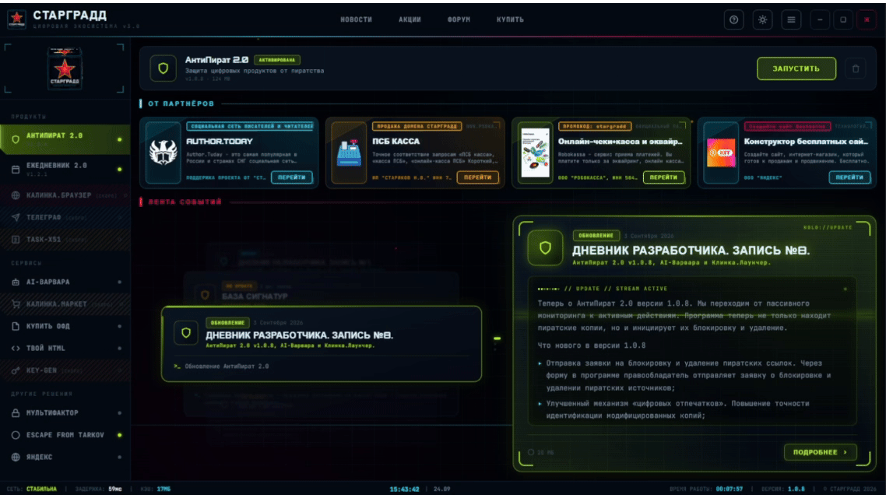

  
  <h1>Калинка.Лаунчер</h1>
  
<b>Единая точка входа в цифровую экосистему СТАРГРАДД</b>

  
Скачивай. Устанавливай. Запускай. — всё в одном месте.

  
Рассказывай про свои проекты или бизнес.

  
  
  
  
  

  [📥 Скачать](https://github.com/nvstarikov/kalinka-launcher/releases/latest) ·
  [💬 Обсуждения](https://github.com/nvstarikov/kalinka-launcher/discussions) ·
  [🐛 Баги](https://github.com/nvstarikov/kalinka-launcher/issues) ·
  [🌐 stargrd.ru](https://stargrd.ru)

---

---

## ✨ Возможности

| Возможность | Описание |
|-------------|----------|
| 🚀 **Единый каталог** | Все продукты, облачные сервисы СТАРГРАДД и партнеров в одном окне |
| ⚡ **Установка в один клик** | Скачивание с прогрессом и тихая установка |
| 🔄 **Автообновления** | Лаунчер и продукты обновляются сами |
| 🔑 **Контроль лицензий** | Статус триала и активации виден всегда |
| 🎨 **Три темы** | Тёмная HUD, светлая и минимальная |
| 📰 **Новости экосистемы** | Анонсы и события прямо в лаунчере |
| 🛡️ **Безопасность** | Всё скачивается только с официального сервера |

---

## 📥 Установка

### Windows 10/11 (x64)

1. Скачай последний установщик со [страницы релизов](https://github.com/ТВОЙ_НИК/kalinka-launcher/releases/latest)
2. Запусти `Kalinka Launcher_<версия>_x64-setup.exe`
3. Следуй инструкциям мастера установки
4. Лаунчер установится в `C:\CTAPGPADD` и создаст ярлык на рабочем столе

> [!WARNING]
> Установщик требует прав администратора Windows.

> [!NOTE]
> Для работы лаунчера нужен доступ в интернет — контент (продукты, новости, баннеры) загружается с официального сервера `stargrd.ru`.

---

## 🖼️ Скриншоты

Показать все скриншоты

### Рабочая область

---

## 🏗️ Технологии

| Слой | Технология |
|------|-----------|
| Десктоп-фреймворк | Tauri 2 |
| Фронтенд | React 18 + TypeScript |
| Бэкенд | Rust |
| Стили | CSS (inline + переменные) |
| Шрифты | Orbitron, JetBrains Mono |

---

## 🗺️ Roadmap

- [x] Реальный полный цикл: скачивание → установка → запуск
- [x] Автоопределение статусов (exe, версия, лицензия)
- [x] Три темы оформления
- [x] Система логирования и отправка отчётов
- [x] Портативные версии продуктов
- [ ] AI-ассистент (Варвара) через API Q4 (2026)
- [ ] Поддержка macOS Q4 (2026)

---

## 🤝 Как помочь проекту

Мы рады любой помощи! Способы:

- ⭐ **Поставь звезду** — это помогает проекту найти новых пользователей
- 🐛 **Сообщи об ошибке** — [создай Issue](https://github.com/nvstarikov/kalinka-launcher/issues/new)
- 💡 **Предложи идею** — [создай Feature Request](https://github.com/nvstarikov/kalinka-launcher/issues/new)
- 💬 **Присоединяйся к обсуждениям** — [Discussions](https://github.com/nvstarikov/kalinka-launcher/discussions)
- 📣 **Расскажи друзьям** — поделись ссылкой на проект

---

## 📄 Лицензия

**Калинка.Лаунчер** — проприетарное программное обеспечение.
© 2026 СТАРГРАДД. Все права защищены.

- ✅ Бесплатное использование для личных, образовательных и некоммерческих целей
- ✅ Распространение оригинального установщика без изменений
- ❌ **Модификация, декомпиляция, реверс-инжиниринг — запрещены**
- ❌ **Распространение изменённых версий — запрещено**
- ❌ **Коммерческое использование без письменного разрешения — запрещено**
- ❌ **Продажа или интеграция в коммерческие продукты — запрещено**

Подробности — в файле [LICENSE](LICENSE).

---

  © 2026 СТАРГРАДД · <a href="https://stargrd.ru">stargrd.ru</a>

