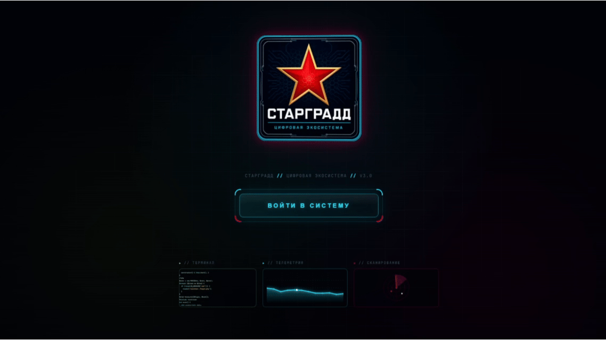

**🌐 Language:** [Русский](README.md) · English

 

  
  <h1>Kalinka.Launcher</h1>
  
<b>The single entry point to the STARGRAD digital ecosystem</b>

  
Download. Install. Launch. — all in one place.

  
  
  
  

  [📥 Download](https://github.com/nvstarikov/kalinka-launcher/releases/latest) ·
  [💬 Discussions](https://github.com/nvstarikov/kalinka-launcher/discussions) ·
  [🐛 Issues](https://github.com/nvstarikov/kalinka-launcher/issues) ·
  [🌐 stargrd.ru](https://stargrd.ru)

---

---

## ✨ Features

| Feature | Description |
|---------|-------------|
| 🚀 **Unified catalog** | All STARGRAD products, cloud services and partner solutions in one window |
| ⚡ **One-click install** | Download with progress and silent installation |
| 🔄 **Auto-updates** | The launcher and its products update themselves |
| 🔑 **License control** | Trial and activation status always visible |
| 🎨 **Three themes** | Dark HUD, light and minimal |
| 📰 **Ecosystem news** | Announcements and events right in the launcher |
| 🛡️ **Security** | Everything is downloaded only from the official server |

---

## 📥 Installation

### Windows 10/11 (x64)

1. Download the latest installer from the [Releases page](https://github.com/nvstarikov/kalinka-launcher/releases/latest)
2. Run `Kalinka Launcher_<version>_x64-setup.exe`
3. Follow the setup wizard instructions
4. The launcher will be installed to `C:\CTAPGPADD` and a desktop shortcut will be created

> [!WARNING]
> The installer requires Windows administrator rights.

> [!NOTE]
> An internet connection is required — content (products, news, banners) is loaded from the official `stargrd.ru` server.

---

### Workspace

---

## 🏗️ Tech Stack

| Layer | Technology |
|-------|-----------|
| Desktop framework | Tauri 2 |
| Frontend | React 18 + TypeScript |
| Bundler | Vite 6 |
| Backend | Rust |
| Styles | CSS (inline + CSS variables) |
| Fonts | Orbitron, JetBrains Mono |

---

## 🗺️ Roadmap

- [x] Full real cycle: download → install → launch
- [x] Automatic status detection (exe, version, license)
- [x] Three UI themes
- [x] Logging system and report submission
- [x] Portable product versions
- [ ] AI assistant (Varvara) via API — Q4 2026
- [ ] macOS support — Q4 2026

---

## 🤝 Contributing

We welcome any help! Ways to contribute:

- ⭐ **Star the project** — this helps the project find new users
- 🐛 **Report a bug** — [create an Issue](https://github.com/nvstarikov/kalinka-launcher/issues/new)
- 💡 **Suggest an idea** — [create a Feature Request](https://github.com/nvstarikov/kalinka-launcher/issues/new)
- 💬 **Join the discussions** — [Discussions](https://github.com/nvstarikov/kalinka-launcher/discussions)
- 📣 **Tell your friends** — share the project link

---

## 📄 License

**Kalinka.Launcher** is proprietary software.
© 2026 STARGRAD. All rights reserved.

- ✅ Free use for personal, educational and non-commercial purposes
- ✅ Distribution of the original installer without modifications
- ❌ **Modification, decompilation, reverse-engineering — prohibited**
- ❌ **Distribution of modified versions — prohibited**
- ❌ **Commercial use without written permission — prohibited**
- ❌ **Sale or integration into commercial products — prohibited**

See [LICENSE](LICENSE) for details.

---

  © 2026 STARGRAD · <a href="https://stargrd.ru">stargrd.ru</a>

